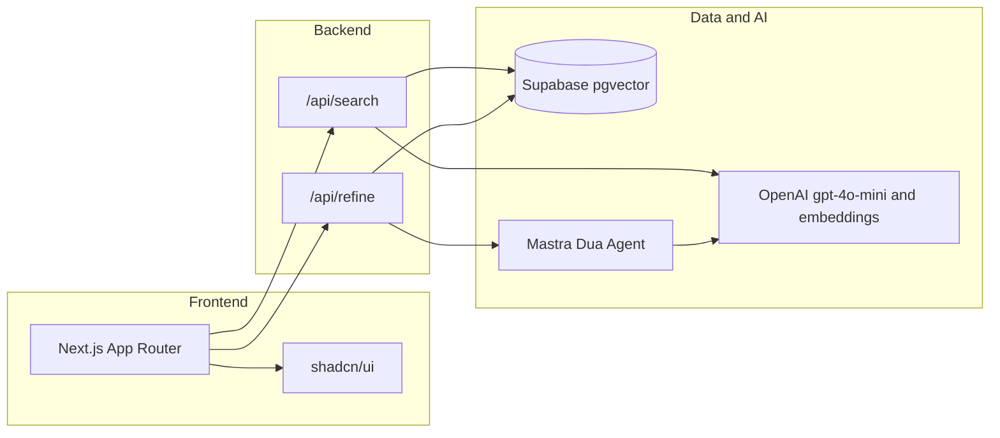

# DuaOS

Match your intent (problem, current du'a, or goal) to Allah's Names and Hadith via semantic search, then refine your du'a in a Prophetic style.

**Stack:** Next.js (App Router), Tailwind CSS, shadcn/ui, Supabase (pgvector), Mastra, OpenAI (gpt-4o-mini + text-embedding-3-small + Whisper for voice).

**Voice input (web):** Speech-to-text uses OpenAI Whisper via `/api/transcribe`. An optional "Arabic" toggle (ع) sends `language: "ar"` to Whisper for better Arabic transcription. For a future React Native (mobile) app, you can use [TarteelAI/voice](https://github.com/TarteelAI/voice) for on-device or online recognition and call the same DuaOS backend APIs (search, refine, transcribe).

## Architecture



## Setup

1. **Clone and install**

   ```bash
   npm install
   ```

2. **Environment**

   Copy `.env.example` to `.env` (or `.env.local`). Next.js only loads files whose names start with `.env` (e.g. `.env`, `.env.local`). Set:

   - `SUPABASE_URL` – Supabase project URL (server-only; never exposed to the client)
   - `SUPABASE_SERVICE_ROLE_KEY` – Supabase service role key (server-only)
   - `OPENAI_API_KEY` – from [OpenAI](https://platform.openai.com)

3. **Supabase**

   - Create a project at [database.new](https://database.new).
   - In SQL Editor run: `CREATE EXTENSION IF NOT EXISTS vector;`
   - Run the schema: paste contents of `supabase/schema.sql` into the SQL Editor and run.

4. **Seed data**

   **Curated only (Names + curated hadith + Quran du'as):**

   ```bash
   npm run seed
   ```

   **Full Quran & Hadith (download repos, chunk, then seed):**

   - Download: `npm run download-data` — fetches full Quran (Arabic, [risan/quran-json](https://github.com/risan/quran-json)) and Sahih Bukhari ([4thel00z/hadith.json](https://github.com/4thel00z/hadith.json)) into `scripts/data/raw/`.
  - Chunk: `npm run chunk-data` — builds `scripts/data/quran-chunks.json` and `hadith-chunks.json` (Quran: one verse per chunk; Hadith: one per hadith, split only if very long).
  - Seed: `npm run seed` — if chunk files exist, seeds from them (full Quran + full downloaded Bukhari); otherwise uses curated `scripts/hadiths.json` and `scripts/quran-duas.json`.
  - Important: all Quran ayas and full downloaded hadith are indexed only when chunk files exist before seed.

   **Licensing:** Full Quran is from [risan/quran-json](https://github.com/risan/quran-json) (CC-BY-SA 4.0); full hadith from [4thel00z/hadith.json](https://github.com/4thel00z/hadith.json) (GPL-3). See [docs/DATA_SOURCES.md](docs/DATA_SOURCES.md) for use and attribution.

   Uses `.env` (Node 20+ `--env-file`). Requires the table and RPC from step 3.

5. **Run dev**

   ```bash
   npm run dev
   ```

   Open [http://localhost:3000](http://localhost:3000).

## Deploy to Vercel

1. Push the repo to GitHub and connect it in [Vercel](https://vercel.com).
2. In the project **Settings → Environment Variables**, add:
   - `OPENAI_API_KEY`
   - `SUPABASE_URL`
   - `SUPABASE_SERVICE_ROLE_KEY`
3. Deploy. All secrets are server-only; the frontend never receives API keys or Supabase credentials.

## Scripts

- `npm run dev` – start Next.js dev server
- `npm run build` – production build
- `npm run seed` – clear and seed `spiritual_assets` with Names + hadith + Quran (full if chunk files exist, curated fallback otherwise)
- `npm run download-data` – download full Quran + Bukhari raw data
- `npm run chunk-data` – build Quran/hadith chunk files from raw data
- `npm run data:pipeline` – run download + chunk + seed

## Project structure

- `src/app/page.tsx` – Search hub (Problem / Refine / Goal) and Refined du'a + Ledger
- `src/app/api/search/route.ts` – Embed query, call `match_documents`, return name + hadith list + quran (rate-limited, validated)
- `src/app/api/refine/route.ts` – Mastra Dua agent stream (rate-limited, validated)
- `src/app/api/transcribe/route.ts` – Whisper transcription (optional `language`, e.g. `ar` for Arabic)
- `src/lib/validation.ts` – Zod schemas and input limits for API routes
- `src/lib/rate-limit.ts` – In-memory rate limiting by IP
- `src/mastra/agents/dua-agent.ts` – DuaOS refiner agent (gpt-4o-mini)
- `scripts/names-of-allah.json` – 99 Names with intent tags
- `scripts/seed-spiritual-assets.ts` – Embed and insert into Supabase
- `supabase/schema.sql` – Table and `match_documents` RPC

## Security

- **No secrets in the frontend:** The app only calls relative URLs (`/api/search`, `/api/refine`). All credentials are read server-side from env; nothing sensitive is in the client bundle.
- **Input validation:** Request bodies are validated with Zod (type, length, trim). Search query and refine input have max lengths to prevent abuse and stay within model limits.
- **SQL injection:** The database is only called via parameterized RPC (`match_documents` with a vector and typed params). User text is never concatenated into SQL.
- **Rate limiting:** In-memory limits by IP: 20 requests/min for search, 10/min for refine. Responses use `429 Too Many Requests` and `Retry-After` when exceeded. For production at scale, use a shared store (e.g. Redis/Upstash).
- **Error messages:** API responses return generic messages (e.g. "Search failed.") and do not leak internal details or stack traces.

## Personal Ledger

Refined du'as can be saved to the **Personal Ledger** (stored in `localStorage`). No auth in this MVP.
